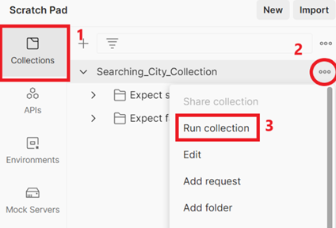
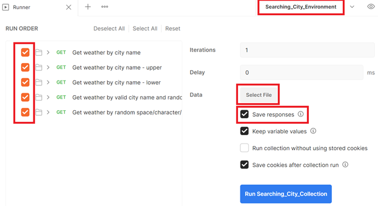
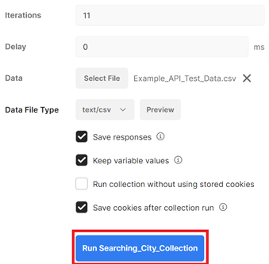
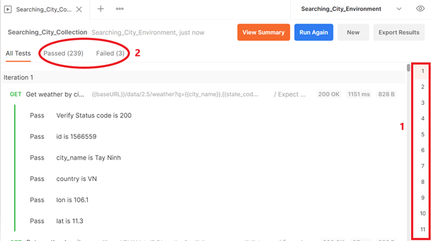
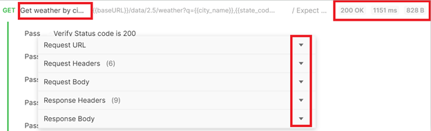
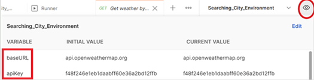
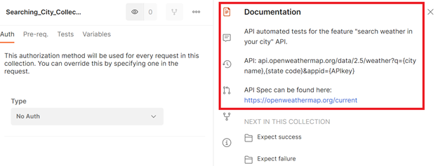
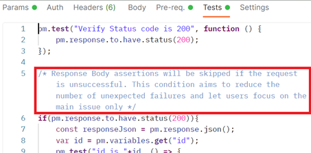
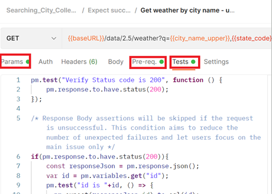
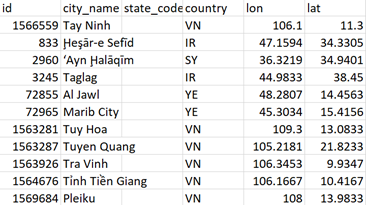

API Automation Test using **Postman**
---
---
This Test Suite was created for the "QA Take-home Assignment".

Automated tests are for the feature "search weather in your city".
   * **API**: api.openweathermap.org/data/2.5/weather?q={city name},{state code}&appid={API key}
   * API Spec can be found here: [openweathermap.org/current](https://openweathermap.org/current)

---

## How to set up and run my test suite?
Please follow these steps:

1. If the Postman tool is not available on your machine, please [downloads](https://www.postman.com/downloads/) and install.

2. Import Collection file:
* Open Postman, select File > Import.
* In the Import windows, select File > Upload Files. Choose the collection file “Collections/Searching_City_Collection.postman_collection.json”
* Click on the Import button

3. Import Environment file:
* Open Postman, select File > Import.
* In the Import windows, select File > Upload Files. Choose the environment file “Environments/Searching_City_Environment.postman_environment.json”
* Click on the Import button

4. Run collection:
* Select “Run collection” on the “Searching_City_Collection”

    
* Select the “Searching_City_Environment” on the upper right corner
* Tick the box "all API requests"
* Tick the box “Save responses”
* Click on the “Select File” and select “Resources/Example_API_Test_Data.csv” 
    
* Then, you will see the values were updated as the screen below. Click on “Run Searching_City_Collection”
    
* Please wait around 2 minutes for the Suite running completed.

---

## How to read the result?

1. The number of Iterations.
* Because there are 11 cities in the Test Data file, so the Iteration number is 11.
2. The number of Passed/Failed Assertions.
* 1 API request can have multiple assertions, so the number of assertions is much higher than the number of API requests multiply with Iterations.

    

    You can click on the request name to see more details such as URL/Header/Body
    

---

## What is in the code?
* {baseURL} and {apiKey} are defined as Environment variables.

    
* There are some descriptions I provide inside the test suite.
    
    
* Tab “Params” to define the REST API URL parameters
* Tab “Pre-req” to write the code will be executed before the request running
* Tab “Tests” to write the code and define assertions, executed after the request running 
    

---

## Data Driven for q parameter?
* Please customize the Test Data CSV file, to configure for Test Suite running by Postman *(Resources/Example_Test_Data.csv)*. Then, select your CSV file when start running the Postman collection.
* Here is a screenshot of Example_Test_Data.csv:

    
